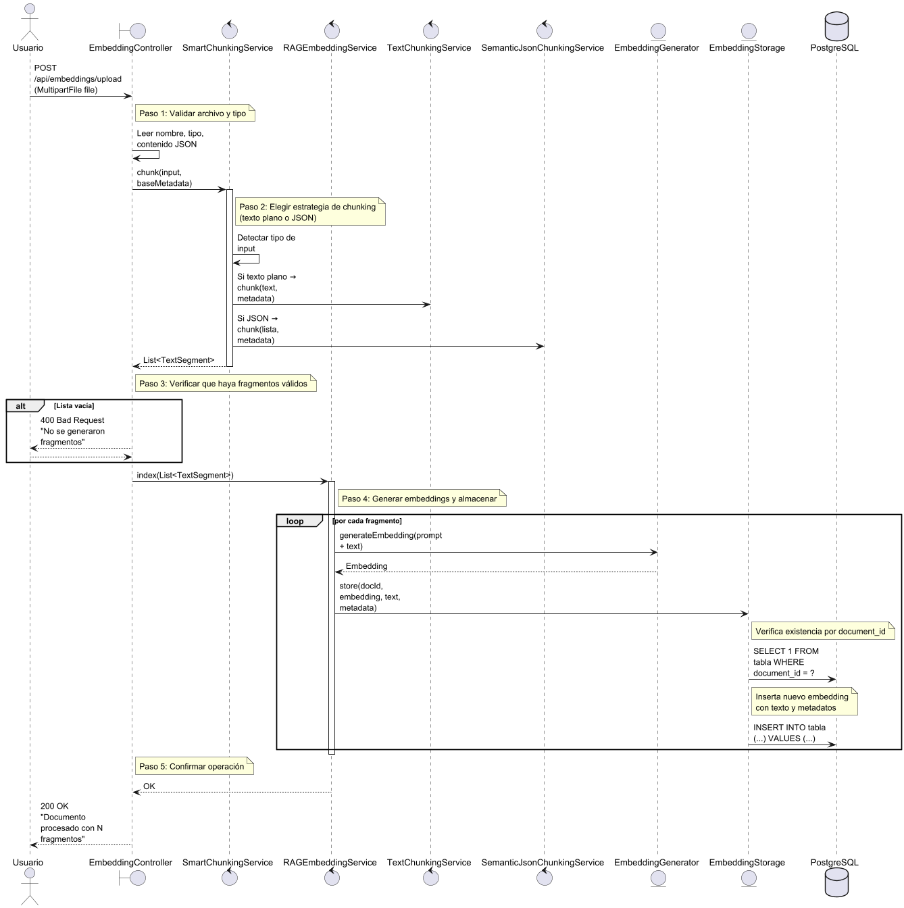
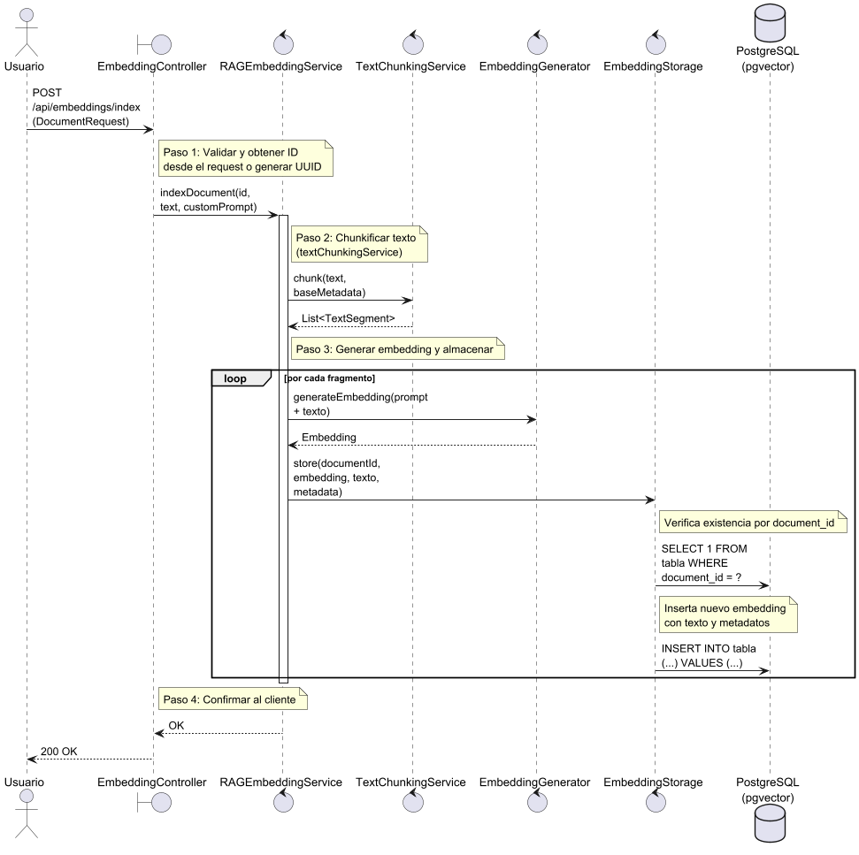
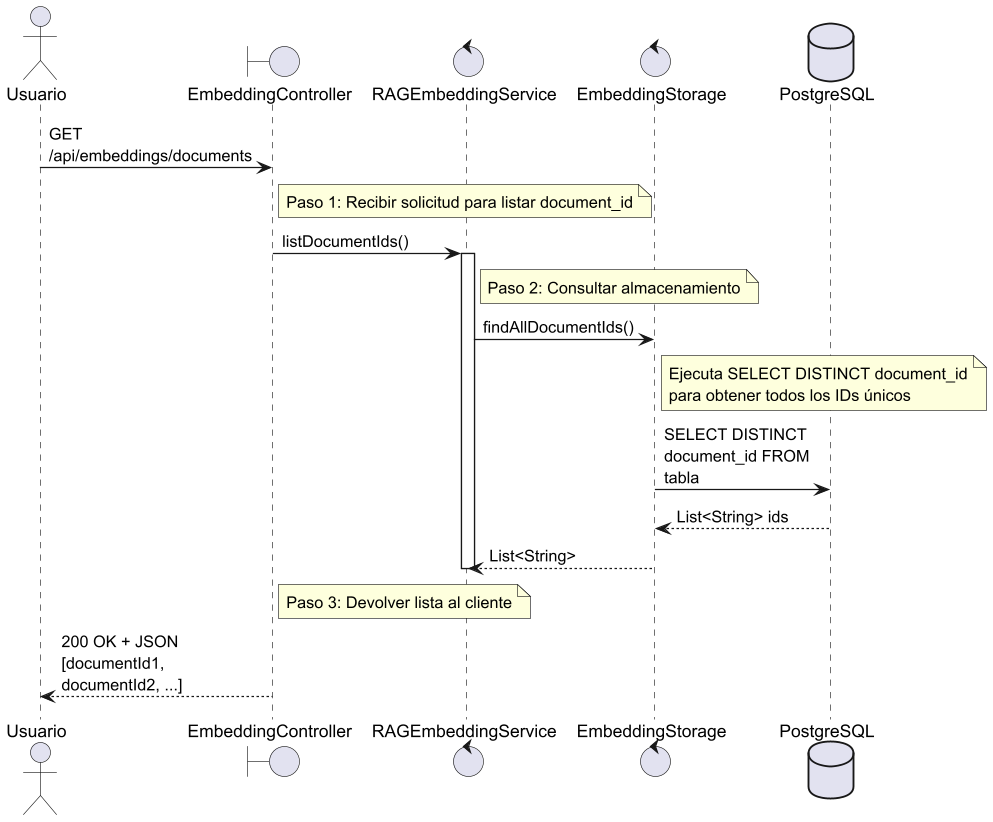

# 📦 Embedding Module

Este módulo forma parte del sistema de recuperación aumentada por generación (RAG). Se encarga del procesamiento, fragmentación, generación y almacenamiento de embeddings para textos o documentos cargados por el usuario.

Los embeddings generados son almacenados en un backend vectorial (por defecto, `pgvector` sobre PostgreSQL), y pueden ser posteriormente buscados por similitud semántica.

---

## 🚀 Funcionalidades principales

- Fragmentación (chunking) inteligente de texto plano o JSON estructurado.
- Generación de embeddings utilizando modelos configurables (por ejemplo, vía Ollama).
- Almacenamiento persistente de fragmentos embebidos con metadatos.
- Búsqueda semántica de documentos similares.
- Limpieza total del índice vectorial.

---

## 📂 Componentes principales

| Componente | Descripción |
|-----------|-------------|
| `EmbeddingController` | Expone los endpoints HTTP. |
| `RAGEmbeddingService` | Lógica de negocio principal para indexación y búsqueda. |
| `TextChunkingService` | Fragmenta texto plano con superposición. |
| `SemanticJsonChunkingService` | Fragmenta JSON estructurado en segmentos semánticos. |
| `EmbeddingGenerator` | Genera vectores numéricos a partir de texto. |
| `EmbeddingStorage` | Almacena y busca embeddings persistentes. |
| `PgVectorEmbeddingStorage` | Implementación de almacenamiento usando `pgvector`. |

---

## 📡 Endpoints de la API

### 📥 `POST /api/embeddings/upload`
**Descripción:** Permite subir un archivo (`.json`, `.txt`, `.pdf`) para su procesamiento e indexación automática.

- Si es `.json`, espera un campo `metadata` y un campo `data` (lista de objetos con `texto`).
- Fragmenta el documento según su tipo (plano o estructurado).
- Genera embeddings para cada fragmento y los almacena.

**Respuesta:**
- `200 OK` con mensaje informando la cantidad de fragmentos indexados.
- `400 Bad Request` si no se generaron fragmentos útiles.





---

### 🧠 `POST /api/embeddings/index`
**Descripción:** Permite indexar directamente texto plano desde una solicitud JSON.

**Request body:**
```json
{
  "id": "documento123",
  "text": "Contenido del documento",
  "customPrompt": "Prompt opcional para mejorar embeddings"
}
```
- Si no se provee `id`, se genera un UUID.
- Fragmenta el texto plano y genera embeddings.
- Almacena todos los fragmentos embebidos.

**Respuesta:** `200 OK` o error 500 con mensaje.



> Archivo fuente: `\images\sequence\EmbeddingController-indexDocument.png`

### 🔎 `GET /api/embeddings/search`
**Descripción:** Realiza una búsqueda semántica sobre los documentos indexados.

**Parámetros:**
- `query` (obligatorio): texto a buscar.
- `maxResults` (opcional): cantidad máxima de resultados. Default configurado.
- `minScore` (opcional): similitud mínima aceptada. Default configurado.

**Respuesta:** Lista ordenada de `documentId` relevantes según similitud.


> Archivo fuente: `\images\sequence\EmbeddingController-search.png`


---

### 📄 `GET /api/embeddings/documents`
**Descripción:** Lista todos los `documentId` distintos almacenados en la base de embeddings.

**Respuesta:**
- `200 OK`: lista de IDs.



> Archivo fuente: `\images\sequence\EmbeddingController-listDocuments.png`

---

### 🧹 `DELETE /api/embeddings/remove-all`
**Descripción:** Elimina **todos** los embeddings almacenados del backend vectorial.

**Advertencia:** operación destructiva que limpia completamente la tabla.

**Respuesta:**
- `200 OK`: éxito.
- `500 Internal Server Error`: si algo falla durante la eliminación.


> Archivo fuente: `\images\sequence\EmbeddingController-removeAll.png`

