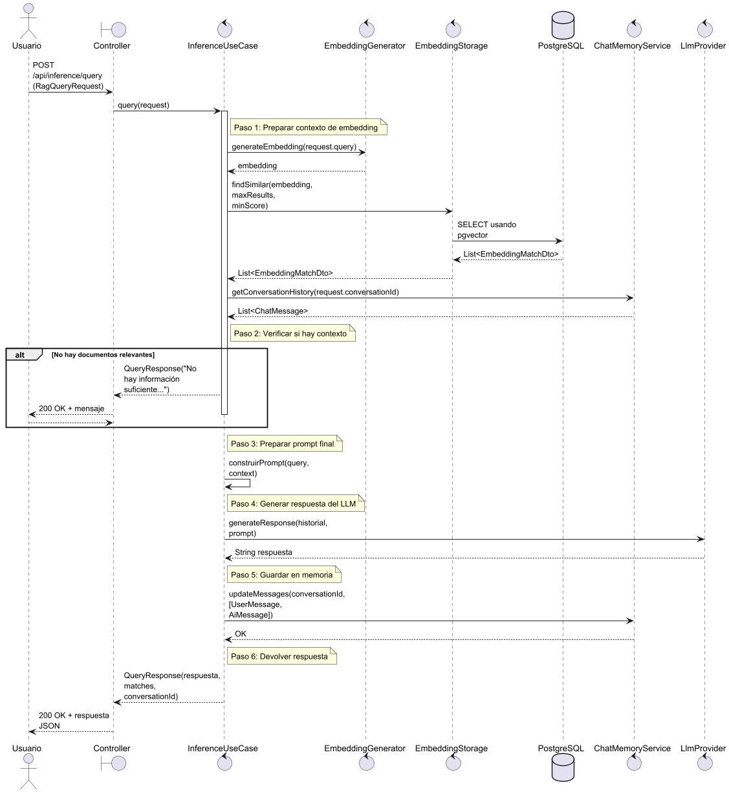
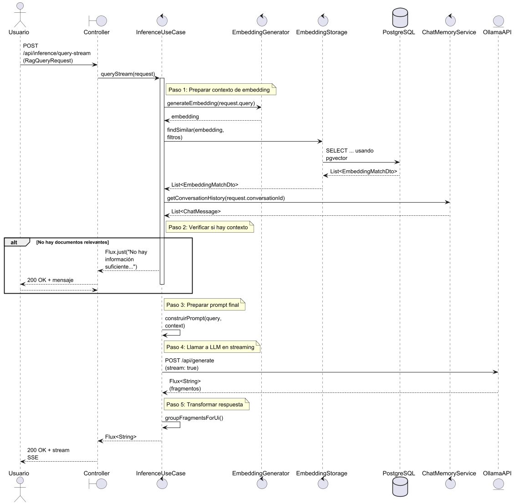
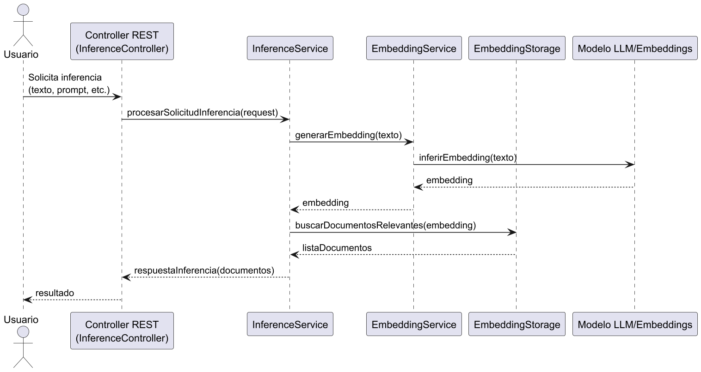

# 🧠 Módulo `inference/`

Este módulo implementa la lógica principal para realizar inferencias con **RAG (Retrieval-Augmented Generation)**, combinando generación de texto con recuperación semántica mediante embeddings.

---

## 🔑 Funciones principales

- 🧠 **Procesar consultas del usuario** mediante generación aumentada por recuperación (RAG).
- 🔍 **Generar embeddings semánticos** a partir de preguntas en lenguaje natural.
- 📄 **Recuperar documentos relevantes** desde un vector store (`pgvector`) con posibles filtros por metadatos.
- 🔄 **Emitir respuestas progresivas (streaming)** vía `Flux<String>` y `text/event-stream` para mejorar experiencia de usuario.
- ✅ **Validar entradas automáticamente** con anotaciones declarativas (`@Valid`, `@Min`, etc.).

---

## 📦 Contenido principal del módulo

### 🔧 Casos de uso
- `InferenceUseCase`: interfaz que define los métodos de consulta.
- `InferenceService`: implementación concreta de los casos de uso, orquesta la interacción entre embeddings, LLM y memoria conversacional.

### 📤 Controladores
- `InferenceController`: expone el endpoint síncrono (consulta básica).
- `InferenceStreamController`: expone el endpoint de **respuesta en streaming (SSE)**.

### 📥 Entrada (DTO)
- `RagQueryRequest`: contiene los parámetros de la consulta del usuario (texto, filtros, metadatos, etc.).

### 📤 Salida (DTO)
- `QueryResponse`: encapsula la respuesta del LLM, matches opcionales y el ID de la conversación.

---

## 📡 Endpoints disponibles

### 📘 `POST /api/inference/query`

Consulta RAG **básica**.

- **Descripción**: Realiza una consulta simple al sistema RAG con configuración predeterminada.
- **Entrada**: `RagQueryRequest`
- **Salida**: `QueryResponse` con:
    - `answer`: texto generado por el modelo.
    - `matches`: lista opcional de documentos recuperados.
    - `conversationId`: identificador de la conversación.

- **Códigos de respuesta**:
    - `200 OK`: consulta exitosa.
    - `400 Bad Request`: validación fallida.

- **Archivo fuente**: `\images\sequence\InferenceController-query.png`

---

### 📘 `POST /api/inference/query-stream`

Consulta **streaming** (respuesta en tiempo real).

- **Descripción**: Envía fragmentos de respuesta generada a medida que se reciben desde el LLM (streaming SSE).
- **Entrada**: `RagQueryRequest`
- **Salida**: `Flux<String>` (stream de texto).

- **Content-Type**: `text/event-stream`
- **Nota**: En caso de no encontrar documentos relevantes, devuelve un único fragmento con el mensaje informativo (`"No hay información suficiente..."`) y no un código HTTP distinto.

- **Archivo fuente**: `\images\sequence\InferenceStreamController-queryStream.png`

---

## 🧠 Flujo de inferencia

1. **Entrada**: el usuario envía una pregunta (`query`) y opcionalmente metadatos o un `documentId`.
2. **Embeddings**: se genera un embedding de la consulta.
3. **Recuperación**:
    - Se buscan documentos similares mediante `PgVectorEmbeddingStorage`, usando PostgreSQL con `pgvector`.
    - Se pueden aplicar filtros por metadatos.
4. **Contexto**: se construye un bloque de texto con los documentos más relevantes.
5. **Prompting**:
    - Se arma un prompt con la `query` y el `context`.
    - Se envía al modelo LLM (`LlmProvider` u Ollama vía WebClient).
6. **Respuesta**:
    - Se guarda el historial conversacional con `ChatMemoryService`.
    - Se devuelve la respuesta generada.

- **Archivo fuente**: `\images\sequence\inference.secuencia.png`

---

## 🛠️ Validaciones

La clase `RagQueryRequest` incluye validaciones automáticas mediante anotaciones:

- `@NotBlank`, `@Min`, `@Max`, `@Schema`, etc.
- Si no se cumplen, el sistema devuelve `400 Bad Request`.

---

## 🧱 Infraestructura utilizada

- **PostgreSQL + pgvector**: para almacenamiento y recuperación de embeddings.
- **LangChain4j**: para la gestión de memoria conversacional (`ChatMemoryStore`).
- **WebClient**: para enviar peticiones HTTP al modelo Ollama en modo streaming.

