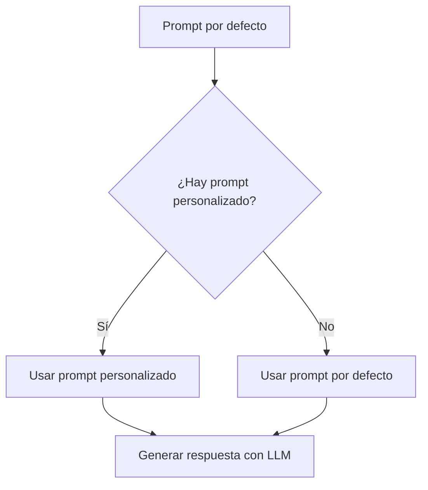

# 🤖 Módulo `llm/`

Este módulo gestiona la configuración y personalización del **modelo de lenguaje (LLM)** usado en el sistema RAG de `evolvAI`.

---

## 🎯 Funcionalidades principales

- 📝 **Gestión de prompts:** Personalización y control dinámico del comportamiento del LLM.
- ⚙️ **Configuración flexible:** Soporta prompts por defecto definidos por configuración y prompts personalizados definidos por el usuario.

---

## 🛣️ Endpoints disponibles

Todos los endpoints están bajo el prefijo `/api/llm`.

### 📋 `GET /prompt`

**Descripción:**  
Obtiene el prompt actual del sistema.

**Comportamiento:**
- Si hay un prompt personalizado cargado, devuelve ese.
- Si no hay ninguno, devuelve el prompt por defecto definido en la configuración (`RagProperties`).

**Respuesta:** `200 OK`

```http
GET /api/llm/prompt
Content-Type: text/plain

Response:
"Eres un asistente AI especializado en..."
```

---

### ✏️ `POST /prompt`

**Descripción:**  
Establece un nuevo prompt personalizado que sobrescribe el prompt por defecto.

**Entrada:**  
Cuerpo plano (`text/plain`) con el texto del nuevo prompt.

**Respuestas:**
- `200 OK` – Prompt actualizado correctamente.
- `400 Bad Request` – Prompt inválido o vacío.
- `500 Internal Server Error` – Error inesperado al guardar el prompt.

```http
POST /api/llm/prompt
Content-Type: text/plain

Body:
"Eres un asistente AI especializado en..."
```

---

### 🧹 `DELETE /prompt`

**Descripción:**  
Resetea el prompt, eliminando el personalizado y restaurando el prompt por defecto del sistema.

**Respuesta:** `200 OK`

```http
DELETE /api/llm/prompt
```

---

## 🔄 Flujo de selección del prompt

