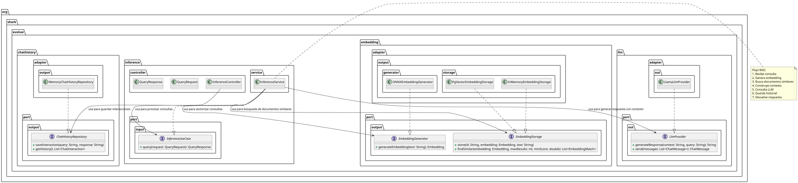

# EvolvAI RAG

## Descripción

## Descripción

EvolvAI RAG es un sistema de Generación Aumentada por Recuperación (RAG) implementado en Java que permite crear aplicaciones conversacionales con acceso a información contextual. El sistema utiliza una arquitectura hexagonal (puertos y adaptadores) que separa claramente las responsabilidades y facilita tanto el mantenimiento como las pruebas.

El proyecto combina la potencia de modelos de embeddings para vectorización de texto, almacenamiento eficiente de vectores con búsqueda semántica y modelos de lenguaje (LLM) para generar respuestas contextualizadas de alta calidad. Además, aprovecha el framework LangChain4j para abstraer la lógica subyacente, permitiendo un diseño altamente modular y desacoplado de las tecnologías específicas. Esta abstracción facilita la integración con diferentes proveedores de embeddings, bases de datos vectoriales y modelos de lenguaje, haciendo que el sistema sea adaptable a nuevas tecnologías sin modificar la lógica central de la aplicación.
## Arquitectura



La arquitectura del sistema está diseñada siguiendo el patrón hexagonal, separando cada dominio funcional en componentes independientes:

### Componentes principales

1. **Embedding**:
    - Vectorización de textos con modelos ONNX pre-entrenados
    - Almacenamiento y recuperación de embeddings mediante PgVector o en memoria
    - Búsqueda semántica para encontrar contenido relevante

2. **LLM**:
    - Integración con modelos de lenguaje como Llama mediante LocalAI
    - Generación de respuestas basadas en contexto recuperado
    - Procesamiento de prompts estructurados con contexto

3. **Inference**:
    - Orquestación del flujo RAG completo
    - Recepción de consultas y entrega de respuestas
    - Coordinación entre componentes (embeddings, almacenamiento, LLM)

4. **Chat History**:
    - Almacenamiento del historial de interacciones
    - Persistencia configurable (memoria o base de datos)
    - Mantenimiento del contexto conversacional

## 📚 Documentación

Consulta la documentación completa del modelo de administrador en [Admin Domain Model](./readme.MD).

## Tecnologías

- **Backend**: Java 17, Spring Boot
- **Embeddings**: ONNX Runtime, MiniLM-L6-v2
- **Almacenamiento vectorial**: PostgreSQL + pgvector
- **LLM**: Llama a través de LocalAI
- **Contenedores**: Docker, Docker Compose
- **Pruebas**: JUnit 5, Mockito

## Requisitos previos

- Java 17+
- Maven 3.8+
- Docker y Docker Compose
- 8GB RAM mínimo (recomendado 16GB para modelos LLM más grandes)

## Instalación y ejecución

1. **Clonar el repositorio**:
   ```bash
   git clone https://github.com/tu-usuario/evolvai-rag.git
   cd evolvai-rag
2. **Descargar modelos**:
    - Coloca el modelo ONNX para embeddings en `src/main/resources/model/all-MiniLM-L6-v2.onnx`
    - Coloca el modelo GGUF para LLM en `src/main/resources/model/ggml-model.gguf`

3. **Configurar LocalAI**:
   Asegúrate de que el archivo `src/main/resources/model/llama2.yaml` esté correctamente configurado:
   ```yaml
   name: llama2
   backend: llama-cpp
   parameters:
     model: ggml-model.gguf
     temperature: 0.7
     n_ctx: 1024
   ```
4. **Iniciar servicios con Docker Compose**:
   ```bash
   docker-compose up -d
   ```   

5. ** Compilar y ejecutar la aplicación:
 ```bash
    mvn clean install
    mvn spring-boot:run
```
## Configuración
La configuración principal se encuentra en application.yaml:
Embedding: Configuración del generador (ONNX) y almacenamiento (memoria o PgVector)
LLM: Configuración del proveedor de LLM (Llama via LocalAI)
Chat Memory: Persistencia del historial de conversaciones
Base de datos: Configuración de conexión a PostgreSQL para almacenamiento de vectores

## Estructura del proyecto
``` bash
src/
├── main/
│   ├── java/org/shark/evolvai/
│   │   ├── embedding/           # Vectorización y almacenamiento
│   │   ├── llm/                 # Integración con modelos de lenguaje
│   │   ├── inference/           # Orquestación del flujo RAG
│   │   ├── chathistory/         # Gestión del historial de conversaciones
│   │   └── config/              # Configuraciones de Spring
│   └── resources/
│       ├── model/               # Modelos LLM y embedding
│       └── application.yaml     # Configuración de la aplicación
└── test/
├── java/                    # Tests unitarios e integración
└── resources/               # Configuración de tests
```

## Pruebas

El proyecto incluye pruebas unitarias y de integración:

```bash
# Ejecutar todas las pruebas
mvn test

# Ejecutar solo pruebas unitarias
mvn test -Dtest=*Test

# Ejecutar pruebas de integración
mvn test -Dtest=*IntegrationTest
```

## Docker Compose

El proyecto utiliza Docker Compose para proporcionar los servicios de infraestructura necesarios:

### Servicios incluidos

1. **pgvector**: Base de datos PostgreSQL con la extensión pgvector
   - Proporciona almacenamiento vectorial para embeddings con capacidad de búsqueda por similitud
   -  Proporciona almacenamiento estandard para la memoria del historial de chat.
   - Persiste datos en un volumen dedicado
   - Se inicializa automáticamente con la estructura necesaria mediante `init_pgvector.sql`

2. **localai**: Servidor de inferencia local para modelos LLM
   - Permite ejecutar modelos de lenguaje localmente sin dependencias externas
   - Expone una API compatible con OpenAI para la generación de texto
   - Monta los modelos desde `src/main/resources/model`

### Configuración

El archivo `docker-compose.yml` está preconfigurado con:
- Puertos: 5432 para PostgreSQL+pgvector y 8000 para LocalAI
- Credenciales por defecto para la base de datos
- Volúmenes para persistencia de datos
- Configuración optimizada para modelos Llama2

### Uso


Para iniciar los servicios:

```bash
# Iniciar en segundo plano
docker-compose up -d

# Ver logs de los servicios
docker-compose logs -f

# Detener servicios
docker-compose down

# Detener y eliminar volúmenes (borra datos persistentes)
docker-compose down -v
```

Nota: Asegúrate de tener los modelos descargados en src/main/resources/model antes de iniciar los servicios.

